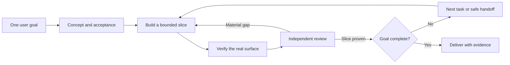

<div align="center">

# Orca Concertante

### Three specialists. One goal. Evidence at every turn.

**Goal-driven loop engineering and agent communication for Orca.**

[](https://github.com/ComBba/orca-concertante/actions/workflows/validate.yml)
[](LICENSE)
[](skills/orca-concertante/SKILL.md)

[Quick start](#quick-start) · [How it works](#how-it-works) · [Verified scope](docs/validation.md) · [한국어](README.ko.md)

</div>

Give your agents a destination, not a stream of “continue” prompts.

Concertante helps specialized coding agents share a goal, communicate through
[Orca](https://www.onorca.dev/), and repeat **build → verify → review → improve**
until the agreed outcome is proven. Ownership and evidence travel with the work
when the next specialist takes over.

Built for frontier coding agents, with configurable roles and models. The default
profile uses Codex and Claude as primary workers, with Antigravity offering an
optional, brief third perspective. Three specialists need not do equal amounts of work.

This is an independent community project, not an official Orca product.

## Quick start

Prerequisites: Orca and its registered CLI, configured coding agents, and Python
3.11+ for the optional helpers. Agents retain their existing authentication and
model configuration. Start with Codex for the default initial-design role.

```bash
npx skills add https://github.com/ComBba/orca-concertante --skill orca-concertante --global
```

For one project, omit `--global`. Review the installer target selection before accepting it. Installation does not change repository rules, provider credentials, models, or production settings.

Then ask your agent:

> Use Orca Concertante to add CSV export to this application. Complete implementation, independent review, and verification. Follow this repository's PR policy.

You can invoke `$orca-concertante` explicitly where supported. Ordinary natural-language discovery depends on the agent's skill support.

## Why Concertante?

| What usually breaks | Concertante's approach |
|---|---|
| Agents optimize different interpretations | One goal contract and observable completion criteria |
| A finished turn is mistaken for finished work | Evidence-driven completion and the next useful task |
| Two agents edit the same scope | One owner; isolated worktrees for independent changes |
| “Continue” prompts replace coordination | Orca tasks, dispatch identities, messages, and settlements |
| Quota pressure loses context | Safe-boundary handoffs preserving goal, authority, source, and evidence |
| Review becomes endless ceremony | Material defects and missing acceptance determine repairs |

## How it works



**Loop engineering** gives every iteration a purpose, owner, observable result,
and next decision. Failed checks lead to repairs. Uncertain external effects
pause that branch for inspection. Genuine missing authority is escalated while
independent work continues.

**Agent communication** carries actionable scope, constraints, source state,
acceptance evidence, and unresolved effects. Orca's Run/Task/Dispatch and inbox
contracts remain lifecycle authority. Concertante does not build a competing
scheduler or task database. Read the [loop design](docs/loop-engineering.md).

## Three specialists, flexible roles

| Responsibility | Default |
|---|---|
| Initial concept, scope, acceptance criteria | Codex |
| Implementation, research, verification | Codex or Claude, chosen per task |
| Independent review | The other primary agent |
| Current coordination | One primary agent at a time |
| Optional third perspective | Antigravity: brief observations only |

These are defaults, not vendor requirements. A project can replace the agents or use one agent, reporting the missing independent review rather than pretending it happened. Work allocation follows task fit, context, access, actual availability, and handoff cost—not subscription price.

Collaboration should be inspectable: the coordinator identifies each participant's role, workspace, and tab, and reports observed progress and results. When the user asks to observe agents or preserve their sessions, settled worker tabs are retained through Orca's supported contract for inspection.

## Included today

- A portable skill entrypoint using the installed Orca CLI's version-matched guides.
- Goal, ownership, handoff, recovery, and evidence conventions.
- Optional read-only `doctor` and advisory `route` helpers; Python standard library only.
- A generic example and executable routing tests.

The helper **does not** collect provider credentials, launch workers, transfer coordinator authority, or run a background scheduler. The agent executes supported Orca operations under the user's task authorization. A skill is guidance, not a guarantee of perpetual unattended execution.

## Helpers

Resolve the installed skill directory and use its script:

```bash
python3 <skill-directory>/scripts/concertante.py doctor <resolved-orca-cli>
python3 <skill-directory>/scripts/concertante.py route <private-snapshot.json>
```

`doctor` reads Orca runtime readiness and advertised capabilities. `route` validates a supplied usage snapshot and recommends keeping or changing the next task owner. Neither mutates Orca or the project. See [usage and routing](skills/orca-concertante/references/usage.md).

Pass the executable resolved by the installed Orca guide, for example `orca` on macOS. On Linux, an explicit executable or Orca's exported CLI environment is required so the helper cannot accidentally select the GNOME screen reader. Doctor errors distinguish missing CLI, timeout, process failure, and malformed status; it deliberately excludes raw stderr and local paths.

## Support and verification

The installed Orca guide is authoritative for command syntax. Initial compatibility inspection used Orca 1.4.222 on macOS; other versions and platforms require their own verification. Unknown capability or ambiguous execution stays unverified.

[Validation status](docs/validation.md) distinguishes local tests, live read-only inspection, installation, and end-to-end agent collaboration. Successful tests do not imply autonomous cross-agent completion is proven.

The current release is an installable skill with executable advisory helpers.
Full cross-agent automation, generic coordinator takeover, host-reboot recovery,
and live Linux/Windows integration remain unverified. See the [roadmap](docs/roadmap.md).

## Development

```bash
python3 tests/test_route.py
python3 -m compileall -q skills/orca-concertante/scripts
```

Use feature branches and commit-preserving PR merges. Do not commit private snapshots, credentials, raw session transcripts, or project-specific operational records.

The highest-value contributions are reproducible failures, real Orca integration
evidence, and simpler paths to verified completion. See [contributing](CONTRIBUTING.md)
and [security](SECURITY.md). If this workflow helps your team, a star makes it
easier for others to discover it.

## Official references

- [Skills registry and distribution](https://www.onorca.dev/docs/cli/skills)
- [Orchestration](https://www.onorca.dev/docs/cli/orchestration)
- [CLI reference](https://www.onorca.dev/docs/cli/reference)
- [Usage tracking](https://www.onorca.dev/docs/agents/usage-tracking)
- [Session restore](https://www.onorca.dev/docs/model/session-restore)

License: MIT.
